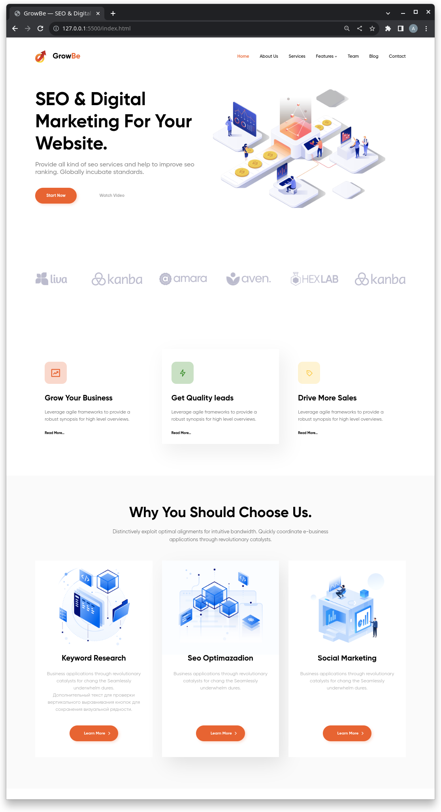
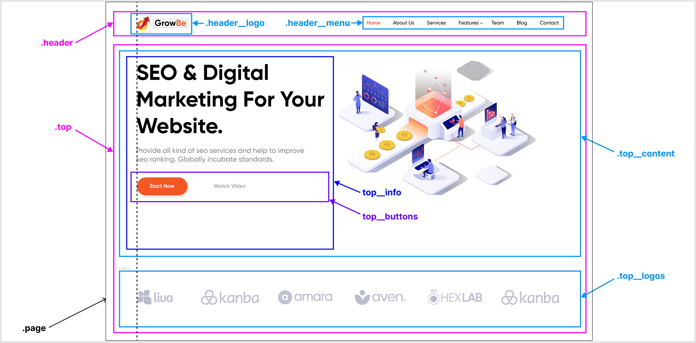

# Задание №5: Стилистика и позиционирование для следующего блока сайта из макета

## Решение

[Директория проекта ./hw5_next/](hw5_next/)

## Полученная страница



# Задание №4: Cтилистика и позиционирование для верхнего блока сайта

* Для всех html элементов из прошлого урока необходимо задать стили в соответствии с макетом.
* Расставить все элементы в соответствии с макетом.

## Решение

[Директория проекта ./hw4_arrangement/](hw4_arrangement/)

Заметим, что визуально содержимое всех элементов выровнено по воображаемой левой
границе корневого элемента (`page`), который в свою очередь отцентрирован
относительно всего пространства окна (см. [иллюстрацию](hw3_layouting/refs/layouting.png) к описанию реализации задания №3).

Таким образом, для реализации указанного позиционирования, для основных внутренних
блоков, ответственных за размещение своих элементов (`.header`, `.top_content`, `.top_logos`),
будем использовать следующий CSS стиль:
```
... {
	display: flex;
	justify-content: flex-start;
	flex-wrap: wrap;
	...
}
```
задавая пространство между элементами с помощью CSS-свойств `column-gap` или `gap`, там где это необходимо.

## Полученная страница


# Задание №3

## Инструкции

* Открыть макет сайта на figma.com
* Необходимо представить разбиение часть на блоки
* Создать новую папку
* Создать файл index.html

В соответствии с макетом необходимо: 

* Добавить все блоки по сайту
* Добавить все наполнение блоков (html контент)
* Все заголовки, параграфы кнопки и изображения

Позиционирование задавать не нужно

* Создать файл стилей style.css
* Подключить стили к index.html
* Добавить обнуление стилей
* Добавить все необходимые отступы margin, padding

## Решение

[Директория проекта ./hw3_layouting/](hw3_layouting/)

*Разбиение макета на блоки:*



## Пример страницы


# Задание №2

## Инструкции

1. Открыть Домашнюю работу из урока 1 
2. Создать файл стилей style.css
3. Подключить ко всем страницам
4. Задать стиль 
`a {
	text-decoration: none;
}`
5. Проверить работу стилей на всех страницах
6. Разделить экран на 2 части, сделать так чтобы файл стилей располагался справа, а все html файлы были слева
7. Для всех ссылок меню задать класс (придумать логичное название класса)
	* color: cornflowerblue;
	* font-size: 16px;
	* line-height: 20px;
8. Проверить отображения стилей на всех страницах проекта
9. Для всех заголовков h1 на сайте задать класс и к нему стиль
	* color: #222222;
	* font-size: 28px;
	* line-height: 36px;
	* font-weight: bold;
10. Для всех параграфов в проекте задать класс
11. К данному классу задать стили
	* font-style: normal;
	* font-weight: 300;
	* font-size: 18px;
	* line-height: 30px;
	* color: #7D7987
12. Для заголовков h2 задать класс
13. К данному классу указать стиль 
	* color: coral;
	* font-style: normal;
	* font-weight: 700;
	* font-size: 36px;
	* line-height: 80px;

## Решение

[Директория проекта ./hw2_store_www/](hw2_store_www/)

## Пример страницы


# Задание №1

1. Скачать и настроить редактор кода, если этого не сделали на семинаре
2. Создать пустую папку, придумать название
3. Создать первую html страницу (index.html)
4. Добавить структуру html документа
5. Добавить меню сайта (Меню сайта должно быть на каждой странице, оно должно быть одинаковым)
	* Главная
	* Каталог
	* Контакты
6. Создать заголовок h1 с текстом "Главная страница"
7. Добавить параграф p с произвольным текстом (lorem) (используем расширение emmet уже установленное в vsc, для этого вводим lorem и нажимаем клавишу tab)
8. Создать подзаголовок h2 с текстом "Добро пожаловать на сайт"
9. Добавить три параграф p с произвольным текстом (lorem)
10. Рядом с файлом index.html создать папку catalog
11. Внутри папки catalog создать файл catalog.html 
12. На странице "каталог" добавить структуру html документа
13. Добавить меню сайта (такое же как на главной странице)
14. Добавить Заголовок h1 с текстом "Каталог"
15. Создать параграф p с произвольным текстом из 150 слов для этого вводим "lorem150" и нажимаем tab
16. Сделать переходы с главной страницы на страницу каталог, при нажатии на меню сайта и переход со страницы каталог на главную страницу
17. Создать папку img и разместить ее рядом с index.html
18. Добавить в папку img произвольные фотографии товаров, по вашей тематике можно выбрать любое фото https://www.freepik.com/search?format=search&orientation=portrait&query=products  
19. На странице "Каталог" после заголовка h1 и параграфа p добавить 
	* Изображение товара
	* Название товара
	* Описасние товара
20. Добавить 3 таких товара на страницу каталога (не следует добавлять более 3х товаров)

## Решение

[Директория проекта ./hw1_store_www/](hw1_store_www/)

## Пример страницы


